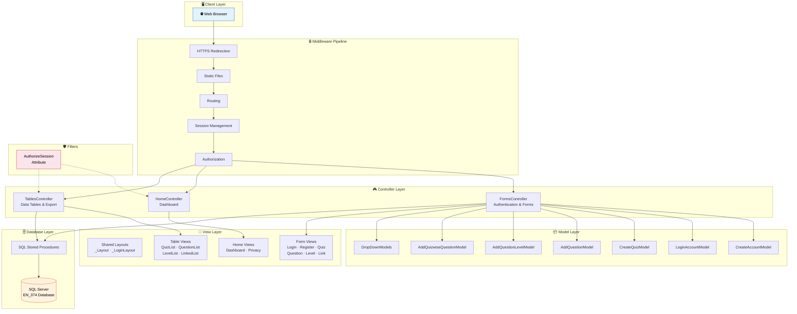
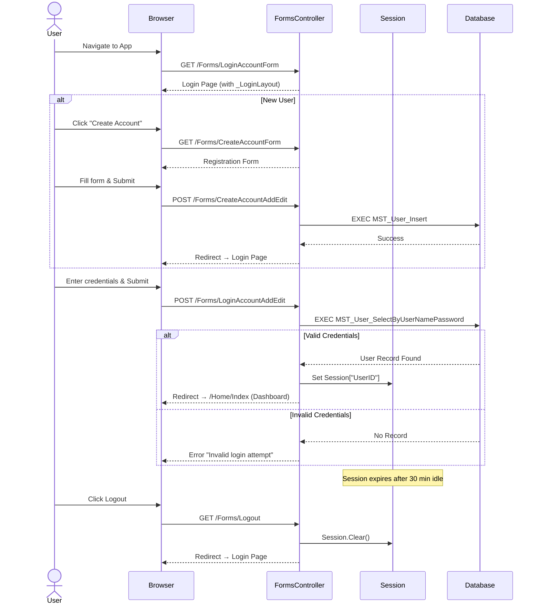
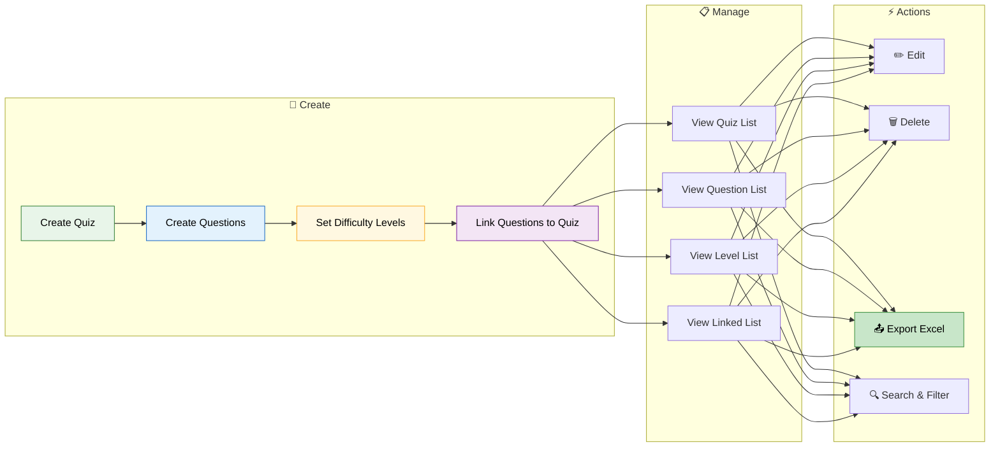
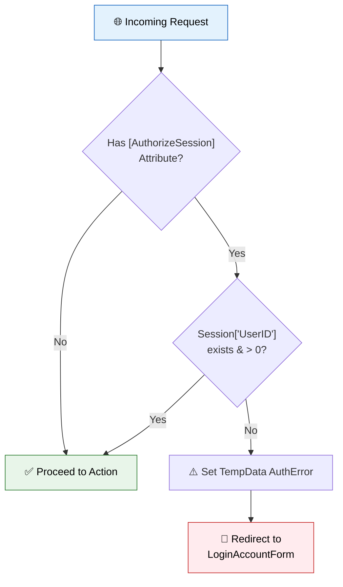
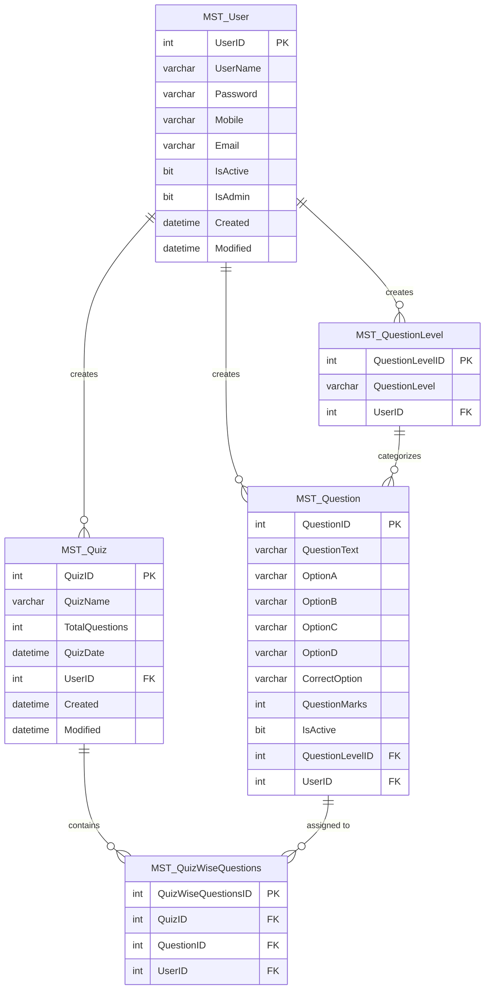
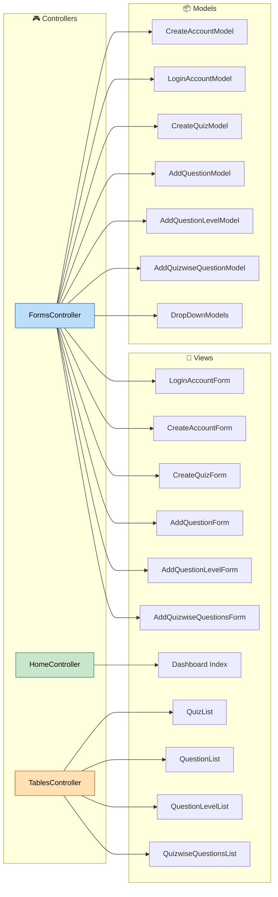

<div align="center">

# 🎯 Quiz Management System

### A Full-Stack ASP.NET Core MVC Web Application

[](https://dotnet.microsoft.com/)
[](https://learn.microsoft.com/en-us/dotnet/csharp/)
[](https://www.microsoft.com/en-us/sql-server)
[](https://getbootstrap.com/)
[](LICENSE)

<br/>


&nbsp;&nbsp;&nbsp;

&nbsp;&nbsp;&nbsp;

&nbsp;&nbsp;&nbsp;

&nbsp;&nbsp;&nbsp;


<br/><br/>

> **Quiz Management System** is a robust, feature-rich web application built with **ASP.NET Core 8.0 MVC** that enables users to create quizzes, manage questions with difficulty levels, link questions to quizzes, and export data to Excel — all with a beautiful modern UI using the **NiceAdmin** template.

</div>

---

## 📋 Table of Contents

- [✨ Features](#-features)
- [🏗️ Architecture Overview](#️-architecture-overview)
- [🗂️ Project Structure](#️-project-structure)
- [🔄 Application Workflow](#-application-workflow)
- [🗄️ Database Schema](#️-database-schema)
- [🧩 MVC Component Map](#-mvc-component-map)
- [⚙️ Tech Stack](#️-tech-stack)
- [🚀 Getting Started](#-getting-started)
- [📸 Screenshots](#-screenshots)
- [🤝 Contributing](#-contributing)

---

## ✨ Features

<table>
<tr>
<td width="50%">

### 🔐 Authentication & Security
- User Registration with validation
- Session-based Login / Logout
- Custom `[AuthorizeSession]` action filter
- Anti-forgery token protection (CSRF)
- 30-minute session timeout

</td>
<td width="50%">

### 📝 Quiz Management
- Create, Edit, Delete quizzes
- Set quiz name, total questions & date
- View all quizzes in data tables
- Search & filter quizzes
- Export quiz data to Excel (.xlsx)

</td>
</tr>
<tr>
<td width="50%">

### ❓ Question Management
- Add questions with 4 MCQ options (A-D)
- Set correct answer & marks
- Assign difficulty levels
- Active/Inactive status toggle
- Full CRUD operations

</td>
<td width="50%">

### 🔗 Quiz-Question Linking
- Link questions to specific quizzes
- Edit/Delete linked associations
- Dropdown selection for quizzes & questions
- Export linked data to Excel
- Constraint protection on delete

</td>
</tr>
<tr>
<td width="50%">

### 📊 Dashboard
- Summary cards (Quizzes, Questions, Levels)
- Progress indicators
- Modern glassmorphism UI
- Dark/Light theme support

</td>
<td width="50%">

### 📤 Data Export
- Export Quizzes to Excel
- Export Questions to Excel
- Export Question Levels to Excel
- Export Linked Questions to Excel
- Powered by EPPlus library

</td>
</tr>
</table>

---

## 🏗️ Architecture Overview

This project follows the **MVC (Model-View-Controller)** architectural pattern with **SQL Server** as the backend database, using **Stored Procedures** for all data operations.



---

## 🗂️ Project Structure

```
📦 Quiz_Management_dot_net
├── 📁 Controllers/                    # MVC Controllers
│   ├── 📄 FormsController.cs          # Auth + all form CRUD operations
│   ├── 📄 HomeController.cs           # Dashboard & home pages
│   └── 📄 TablesController.cs         # Data listing & Excel export
│
├── 📁 Filters/                        # Custom Action Filters
│   └── 📄 AuthorizeSessionAttribute.cs # Session-based auth guard
│
├── 📁 Models/                         # Data Models with Validation
│   ├── 📄 CreateAccountModel.cs       # User registration model
│   ├── 📄 LoginAccountModel.cs        # User login model
│   ├── 📄 CreateQuizModel.cs          # Quiz creation/edit model
│   ├── 📄 AddQuestionModel.cs         # Question CRUD model
│   ├── 📄 AddQuestionLevelModel.cs    # Difficulty level model
│   ├── 📄 AddQuizwiseQuestionModel.cs # Quiz-question link model
│   ├── 📄 DropDownModel.cs            # Dropdown list models
│   └── 📄 ErrorViewModel.cs           # Error display model
│
├── 📁 Views/                          # Razor Views
│   ├── 📁 Forms/                      # Input form views
│   │   ├── 📄 LoginAccountForm.cshtml
│   │   ├── 📄 CreateAccountForm.cshtml
│   │   ├── 📄 CreateQuizForm.cshtml
│   │   ├── 📄 AddQuestionForm.cshtml
│   │   ├── 📄 AddQuestionLevelForm.cshtml
│   │   └── 📄 AddQuizwiseQuestionsForm.cshtml
│   │
│   ├── 📁 Tables/                     # Data table views
│   │   ├── 📄 QuizList.cshtml
│   │   ├── 📄 QuestionList.cshtml
│   │   ├── 📄 QuestionLevelList.cshtml
│   │   └── 📄 AddQuizwiseQuestionsList.cshtml
│   │
│   ├── 📁 Home/                       # Home pages
│   │   ├── 📄 Index.cshtml            # Dashboard
│   │   └── 📄 Privacy.cshtml
│   │
│   ├── 📁 Shared/                     # Shared layouts
│   │   ├── 📄 _Layout.cshtml          # Main app layout (sidebar + navbar)
│   │   ├── 📄 _Layout.cshtml.css      # Layout styles
│   │   ├── 📄 _LoginLayout.cshtml     # Login/Register layout (particles bg)
│   │   └── 📄 Error.cshtml
│   │
│   ├── 📄 _ViewImports.cshtml         # Global using directives
│   └── 📄 _ViewStart.cshtml           # Default layout assignment
│
├── 📁 Properties/                     # Launch settings
├── 📄 Program.cs                      # App entry point & middleware config
├── 📄 appsettings.json                # Connection strings & config
├── 📄 QuizeManagement_Project.csproj  # Project dependencies
└── 📄 QuizeManagement_Project.sln     # Solution file
```

---

## 🔄 Application Workflow

### 🔑 Authentication Flow



### 📝 Quiz & Question Management Flow



### 🛡️ Session Authorization Flow



---

## 🗄️ Database Schema



### 📦 Stored Procedures Used

| Stored Procedure | Description |
|:---|:---|
| `MST_User_Insert` | Register a new user |
| `MST_User_SelectByUserNamePassword` | Authenticate user login |
| `MST_Quiz_SelectAll` | Fetch all quizzes |
| `MST_Quiz_InsertUpdate` | Create or update a quiz |
| `MST_Quiz_DeleteByPK` | Delete a quiz by ID |
| `MST_Quiz_SelectByPK` | Get quiz details by ID |
| `MST_Question_SelectAll` | Fetch all questions |
| `MST_Question_InsertUpdate` | Create or update a question |
| `MST_Question_DeleteByPK` | Delete a question by ID |
| `MST_Question_SelectByPK` | Get question details by ID |
| `MST_QuestionLevel_SelectAll` | Fetch all difficulty levels |
| `MST_QuestionLevel_InsertUpdate` | Create or update a level |
| `MST_QuestionLevel_DeleteByPK` | Delete a level by ID |
| `MST_QuestionLevel_SelectByPK` | Get level details by ID |
| `MST_QuizWiseQuestions_SelectAll` | Fetch all quiz-question links |
| `MST_QuizWiseQuestions_InsertUpdate` | Create or update a link |
| `MST_QuizWiseQuestions_DeleteByPK` | Delete a link by ID |
| `MST_QuizWiseQuestions_SelectByPK` | Get link details by ID |

---

## 🧩 MVC Component Map



---

## ⚙️ Tech Stack

| Layer | Technology | Version |
|:---:|:---|:---|
| 🖥️ **Runtime** | .NET | 8.0 |
| 🔤 **Language** | C# | 12.0 |
| 🏗️ **Framework** | ASP.NET Core MVC | 8.0 |
| 🎨 **Frontend** | Razor Views + Bootstrap | 5.3.3 |
| 🗄️ **Database** | Microsoft SQL Server | Express |
| 📡 **Data Access** | ADO.NET (SqlClient) | 4.9.0 |
| 📊 **Excel Export** | EPPlus | 7.6.1 |
| 🎭 **UI Template** | NiceAdmin | Bootstrap 5 |
| 🔤 **Fonts** | Google Fonts (Inter, Poppins) | — |
| 🎨 **Icons** | Font Awesome + Bootstrap Icons | 6.x |

---

## 🚀 Getting Started

### Prerequisites

- [.NET 8.0 SDK](https://dotnet.microsoft.com/download/dotnet/8.0) or later
- [SQL Server Express](https://www.microsoft.com/en-us/sql-server/sql-server-downloads) (or any SQL Server edition)
- [Visual Studio 2022](https://visualstudio.microsoft.com/) (recommended) or VS Code

### Installation

**1. Clone the repository**
```bash
git clone https://github.com/Shivam93294Valand/Quiz_Management_dot_net.git
cd Quiz_Management_dot_net
```

**2. Set up the Database**

Create a database named `EN_374` in SQL Server and execute all the required stored procedures (listed in the [Stored Procedures](#-stored-procedures-used) section).

**3. Update Connection String**

Edit `appsettings.json` and update the connection string to match your SQL Server instance:

```json
{
  "ConnectionStrings": {
    "ConnectionString": "Data Source=YOUR_SERVER_NAME; Initial Catalog=EN_374; Integrated Security=true;"
  }
}
```

**4. Restore dependencies & Run**
```bash
dotnet restore
dotnet run
```

**5. Open in browser**
```
https://localhost:5001
```

> 💡 The app starts on the **Login page** (`/Forms/LoginAccountForm`) by default. Create an account first to access the dashboard.

---

## 📸 Screenshots

| Page | Description |
|:---|:---|
| 🔐 **Login** | Beautiful dark-themed login page with particle.js animated background |
| 📝 **Register** | User registration form with validation |
| 📊 **Dashboard** | Overview cards showing total quizzes, questions & levels |
| 📋 **Quiz List** | Data table with search, edit, delete & Excel export |
| ❓ **Question Form** | MCQ question creation with 4 options & difficulty level |
| 🔗 **Link Manager** | Associate questions to quizzes via dropdown selectors |

---

## 🛣️ Route Map

| HTTP Method | Route | Controller | Action | Auth Required |
|:---:|:---|:---|:---|:---:|
| GET | `/` | Forms | LoginAccountForm | ❌ |
| GET | `/Forms/CreateAccountForm` | Forms | CreateAccountForm | ❌ |
| POST | `/Forms/CreateAccountAddEdit` | Forms | CreateAccountAddEdit | ❌ |
| POST | `/Forms/LoginAccountAddEdit` | Forms | LoginAccountAddEdit | ❌ |
| GET | `/Forms/Logout` | Forms | Logout | ❌ |
| GET | `/Home/Index` | Home | Index | ✅ |
| GET | `/Forms/CreateQuizForm` | Forms | CreateQuizForm | ✅ |
| POST | `/Forms/CreateQuizAddEdit` | Forms | CreateQuizAddEdit | ✅ |
| GET | `/Tables/QuizList` | Tables | QuizList | ✅ |
| GET | `/Tables/QuizDelete/{id}` | Tables | QuizDelete | ✅ |
| GET | `/Tables/QuizExportToExcel` | Tables | QuizExportToExcel | ✅ |
| GET | `/Forms/AddQuestionForm` | Forms | AddQuestionForm | ✅ |
| GET | `/Tables/QuestionList` | Tables | QuestionList | ✅ |
| GET | `/Tables/QuestionExportToExcel` | Tables | QuestionExportToExcel | ✅ |
| GET | `/Forms/AddQuestionLevelForm` | Forms | AddQuestionLevelForm | ✅ |
| GET | `/Tables/QuestionLevelList` | Tables | QuestionLevelList | ✅ |
| GET | `/Forms/AddQuizwiseQuestionsForm` | Forms | AddQuizwiseQuestionsForm | ✅ |
| GET | `/Tables/AddQuizwiseQuestionsList` | Tables | AddQuizwiseQuestionsList | ✅ |

---

## 🤝 Contributing

Contributions are welcome! Here's how you can help:

1. **Fork** the repository
2. **Create** a feature branch: `git checkout -b feature/amazing-feature`
3. **Commit** your changes: `git commit -m 'Add amazing feature'`
4. **Push** to the branch: `git push origin feature/amazing-feature`
5. **Open** a Pull Request

---

<div align="center">

### ⭐ Star this repo if you found it useful!

Made with ❤️ by [Shivam Valand](https://github.com/Shivam93294Valand)

</div>
